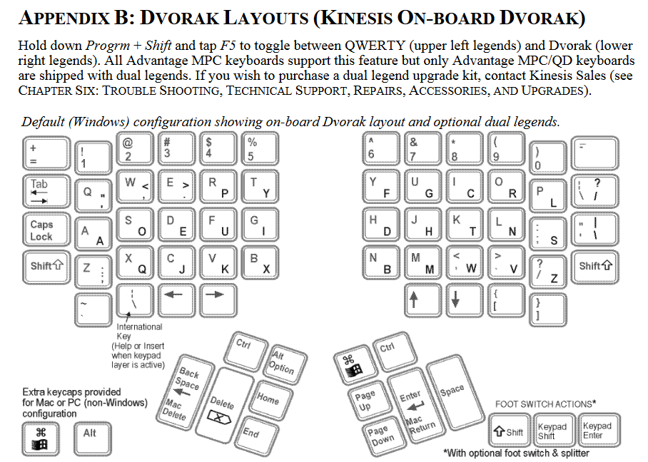

# Intercepted Conversations Pt.1 (forensic · 110 pt)

This traffic was picked up by one of our agents. We think this might be a conversation between two elite hackers that we are investigating. 
Can you see if you can analyze the data? intercept.pcapng

Wireshark show us a USB traffic between two devices

The first part of the wireshark capture indicate us an exchange between 2 devices, and the second part show an USB device sending URB_interrupt (maybe the flag)

```
trame 64 > interessant hint ! :  ID product : Kinesis Integrated
trame 72 > Kinesis integrated keyboard
```

the flag seems to be a keyboard key text

there is 4 basic USB transfer mode : control, interrupt, isochronous, bulk

http://www.beyondlogic.org/usbnutshell/usb4.shtml#Interrupt

I saw a lot of communication between 3.21.1 and the host
72 bytes in one hand
64 bytes in other hand

8 bytes de data!  it match with the "INterrupt mode"

 "the maximum data payload size for low-speed devices is 8 bytes"
 
 I used this filter in wireshark :
```
((usb.transfer_type == 0x01) && (frame.len == 72))
```


for each line :  "leftover capture data" = 8 bytes of data

I'm looking if it's possible to match an hexa value of this 8 bytes of data, and a keyboard key.


I found a documentation who spoke about that :  
```
root@kali:~# wget http://www.usb.org/developers/hidpage/Hut1_12v2.pdf
(page 53)
```

for each line I deduct the flag : gidiky{,j0-p1v3;-x,3o7t-4lt,4t5}

obviously it's not the good one : )

So I'm looking on the maker of the kinesis integrated keyboard, if there is some specificities with the KINESIS KEYBOARD

On this document : 

http://www.kinesis-ergo.com/wp-content/uploads/2015/01/kinesis_advantage_user_manual.pdf
(page 39)



great ! 

iceCTF{wh0_l1k3s_qw3r7y_4nyw4y5}

eilco


