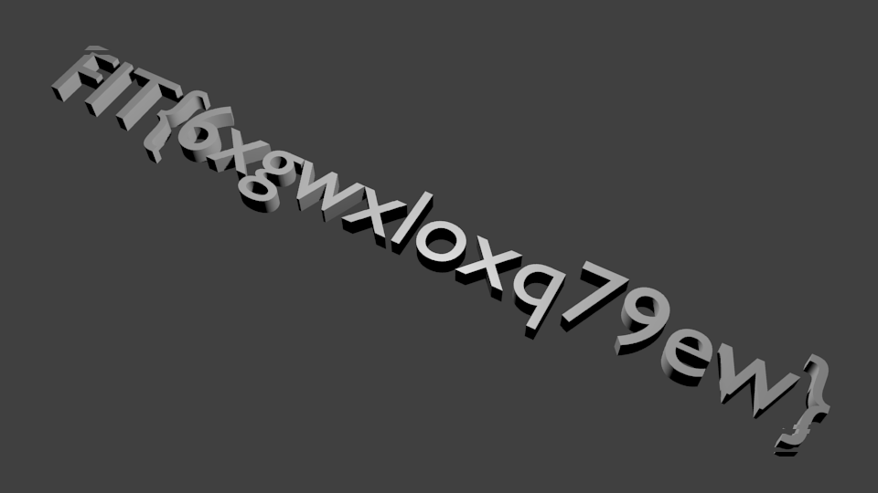

**Connect - 150pts**

Locate and connect.

So we have a PNG file !


```BASH
file flag.png 
flag.png: PNG image data, 960 x 5, 8-bit/color RGBA, non-interlaced
```


When you have a PNG file often your reflex is to analyze precisely headers / embedded files /..

```BASH
pngcheck flag.png 
flag.png  additional data after IEND chunk
ERROR: flag.png

hachoir-subfile flag.png 
[+] Start search on 84177 bytes (82.2 KB)

[+] File at 0 size=330 (330 bytes): PNG picture: 960x5x32 (alpha layer)
[+] File at 330 size=139 (139 bytes): PNG picture: 960x5x32 (alpha layer)
[+] File at 469 size=139 (139 bytes): PNG picture: 960x5x32 (alpha layer)
[+] File at 608 size=139 (139 bytes): PNG picture: 960x5x32 (alpha layer)
[+] File at 747 size=139 (139 bytes): PNG picture: 960x5x32 (alpha layer)
[+] File at 886 size=139 (139 bytes): PNG picture: 960x5x32 (alpha layer)
[+] File at 1025 size=139 (139 bytes): PNG picture: 960x5x32 (alpha layer)
[+] File at 1164 size=139 (139 bytes): PNG picture: 960x5x32 (alpha layer)
[+] File at 1303 size=139 (139 bytes): PNG picture: 960x5x32 (alpha layer)
[+] File at 1442 size=139 (139 bytes): PNG picture: 960x5x32 (alpha layer)
[+] File at 1581 size=254 (254 bytes): PNG picture: 960x5x32 (alpha layer)
[+] File at 1835 size=357 (357 bytes): PNG picture: 960x5x32 (alpha layer)
[+] File at 2192 size=516 (516 bytes): PNG picture: 960x5x32 (alpha layer)
[+] File at 2708 size=603 (603 bytes): PNG picture: 960x5x32 (alpha layer)
[+] File at 3311 size=657 (657 bytes): PNG picture: 960x5x32 (alpha layer)
[+] File at 3968 size=764 (764 bytes): PNG picture: 960x5x32 (alpha layer)
[+] File at 4732 size=932 (932 bytes): PNG picture: 960x5x32 (alpha layer)
[+] File at 5664 size=895 (895 bytes): PNG picture: 960x5x32 (alpha layer)
[+] File at 6559 size=893 (893 bytes): PNG picture: 960x5x32 (alpha layer)
[+] File at 7452 size=952 (952 bytes): PNG picture: 960x5x32 (alpha layer)
[+] File at 8404 size=845 (845 bytes): PNG picture: 960x5x32 (alpha layer)
[+] File at 9249 size=1079 (1079 bytes): PNG picture: 960x5x32 (alpha layer)
[+] File at 10328 size=901 (901 bytes): PNG picture: 960x5x32 (alpha layer)
[+] File at 11229 size=936 (936 bytes): PNG picture: 960x5x32 (alpha layer)
[+] File at 12165 size=946 (946 bytes): PNG picture: 960x5x32 (alpha layer)
[+] File at 13111 size=1031 (1031 bytes): PNG picture: 960x5x32 (alpha layer)
[+] File at 14142 size=795 (795 bytes): PNG picture: 960x5x32 (alpha layer)
[+] File at 14937 size=927 (927 bytes): PNG picture: 960x5x32 (alpha layer)
[+] File at 15864 size=976 (976 bytes): PNG picture: 960x5x32 (alpha layer)
[+] File at 16840 size=726 (726 bytes): PNG picture: 960x5x32 (alpha layer)
[+] File at 17566 size=895 (895 bytes): PNG picture: 960x5x32 (alpha layer)
[+] File at 18461 size=983 (983 bytes): PNG picture: 960x5x32 (alpha layer)
[+] File at 19444 size=1029 (1029 bytes): PNG picture: 960x5x32 (alpha layer)
[+] File at 20473 size=1019 (1019 bytes): PNG picture: 960x5x32 (alpha layer)
[+] File at 21492 size=1268 (1268 bytes): PNG picture: 960x5x32 (alpha layer)
[+] File at 22760 size=1370 (1370 bytes): PNG picture: 960x5x32 (alpha layer)
[+] File at 24130 size=975 (975 bytes): PNG picture: 960x5x32 (alpha layer)
[+] File at 25105 size=1134 (1134 bytes): PNG picture: 960x5x32 (alpha layer)
[+] File at 26239 size=1033 (1033 bytes): PNG picture: 960x5x32 (alpha layer)
[+] File at 27272 size=954 (954 bytes): PNG picture: 960x5x32 (alpha layer)
[+] File at 28226 size=1302 (1302 bytes): PNG picture: 960x5x32 (alpha layer)
[+] File at 29528 size=1237 (1237 bytes): PNG picture: 960x5x32 (alpha layer)
[+] File at 30765 size=1442 (1442 bytes): PNG picture: 960x5x32 (alpha layer)
[+] File at 32207 size=1313 (1313 bytes): PNG picture: 960x5x32 (alpha layer)
[+] File at 33520 size=1315 (1315 bytes): PNG picture: 960x5x32 (alpha layer)
[+] File at 34835 size=1223 (1223 bytes): PNG picture: 960x5x32 (alpha layer)
[+] File at 36058 size=1024 (1024 bytes): PNG picture: 960x5x32 (alpha layer)
[+] File at 37082 size=850 (850 bytes): PNG picture: 960x5x32 (alpha layer)
[+] File at 37932 size=1068 (1068 bytes): PNG picture: 960x5x32 (alpha layer)
[+] File at 39000 size=844 (844 bytes): PNG picture: 960x5x32 (alpha layer)
[+] File at 39844 size=1055 (1055 bytes): PNG picture: 960x5x32 (alpha layer)
[+] File at 40899 size=1028 (1028 bytes): PNG picture: 960x5x32 (alpha layer)
[+] File at 41927 size=965 (965 bytes): PNG picture: 960x5x32 (alpha layer)
[+] File at 42892 size=901 (901 bytes): PNG picture: 960x5x32 (alpha layer)
[+] File at 43793 size=879 (879 bytes): PNG picture: 960x5x32 (alpha layer)
[+] File at 44672 size=1199 (1199 bytes): PNG picture: 960x5x32 (alpha layer)
[+] File at 45871 size=862 (862 bytes): PNG picture: 960x5x32 (alpha layer)
[+] File at 46733 size=944 (944 bytes): PNG picture: 960x5x32 (alpha layer)
[+] File at 47677 size=1111 (1111 bytes): PNG picture: 960x5x32 (alpha layer)
[+] File at 48788 size=1376 (1376 bytes): PNG picture: 960x5x32 (alpha layer)
[+] File at 50164 size=1072 (1072 bytes): PNG picture: 960x5x32 (alpha layer)
[+] File at 51236 size=1066 (1066 bytes): PNG picture: 960x5x32 (alpha layer)
[+] File at 52302 size=1152 (1152 bytes): PNG picture: 960x5x32 (alpha layer)
[+] File at 53454 size=1223 (1223 bytes): PNG picture: 960x5x32 (alpha layer)
[+] File at 54677 size=1205 (1205 bytes): PNG picture: 960x5x32 (alpha layer)
[+] File at 55882 size=1261 (1261 bytes): PNG picture: 960x5x32 (alpha layer)
[+] File at 57143 size=1032 (1032 bytes): PNG picture: 960x5x32 (alpha layer)
[+] File at 58175 size=1048 (1048 bytes): PNG picture: 960x5x32 (alpha layer)
[+] File at 59223 size=1090 (1090 bytes): PNG picture: 960x5x32 (alpha layer)
[+] File at 60313 size=997 (997 bytes): PNG picture: 960x5x32 (alpha layer)
[+] File at 61310 size=931 (931 bytes): PNG picture: 960x5x32 (alpha layer)
[+] File at 62241 size=882 (882 bytes): PNG picture: 960x5x32 (alpha layer)
[+] File at 63123 size=939 (939 bytes): PNG picture: 960x5x32 (alpha layer)
[+] File at 64062 size=858 (858 bytes): PNG picture: 960x5x32 (alpha layer)
[+] File at 64920 size=854 (854 bytes): PNG picture: 960x5x32 (alpha layer)
[+] File at 65774 size=943 (943 bytes): PNG picture: 960x5x32 (alpha layer)
[+] File at 66717 size=885 (885 bytes): PNG picture: 960x5x32 (alpha layer)
[+] File at 67602 size=881 (881 bytes): PNG picture: 960x5x32 (alpha layer)
[+] File at 68483 size=996 (996 bytes): PNG picture: 960x5x32 (alpha layer)
[+] File at 69479 size=1079 (1079 bytes): PNG picture: 960x5x32 (alpha layer)
[+] File at 70558 size=1106 (1106 bytes): PNG picture: 960x5x32 (alpha layer)
[+] File at 71664 size=1062 (1062 bytes): PNG picture: 960x5x32 (alpha layer)
[+] File at 72726 size=1071 (1071 bytes): PNG picture: 960x5x32 (alpha layer)
[+] File at 73797 size=863 (863 bytes): PNG picture: 960x5x32 (alpha layer)
[+] File at 74660 size=976 (976 bytes): PNG picture: 960x5x32 (alpha layer)
[+] File at 75636 size=790 (790 bytes): PNG picture: 960x5x32 (alpha layer)
[+] File at 76426 size=713 (713 bytes): PNG picture: 960x5x32 (alpha layer)
[+] File at 77139 size=689 (689 bytes): PNG picture: 960x5x32 (alpha layer)
[+] File at 77828 size=732 (732 bytes): PNG picture: 960x5x32 (alpha layer)
[+] File at 78560 size=566 (566 bytes): PNG picture: 960x5x32 (alpha layer)
[+] File at 79126 size=554 (554 bytes): PNG picture: 960x5x32 (alpha layer)
[+] File at 79680 size=472 (472 bytes): PNG picture: 960x5x32 (alpha layer)
[+] File at 80152 size=402 (402 bytes): PNG picture: 960x5x32 (alpha layer)
[+] File at 80554 size=307 (307 bytes): PNG picture: 960x5x32 (alpha layer)
[+] File at 80861 size=357 (357 bytes): PNG picture: 960x5x32 (alpha layer)
[+] File at 81218 size=435 (435 bytes): PNG picture: 960x5x32 (alpha layer)
[+] File at 81653 size=403 (403 bytes): PNG picture: 960x5x32 (alpha layer)
[+] File at 82056 size=432 (432 bytes): PNG picture: 960x5x32 (alpha layer)
[+] File at 82488 size=290 (290 bytes): PNG picture: 960x5x32 (alpha layer)
[+] File at 82778 size=287 (287 bytes): PNG picture: 960x5x32 (alpha layer)
[+] File at 83065 size=139 (139 bytes): PNG picture: 960x5x32 (alpha layer)
[+] File at 83204 size=139 (139 bytes): PNG picture: 960x5x32 (alpha layer)
[+] File at 83343 size=139 (139 bytes): PNG picture: 960x5x32 (alpha layer)
[+] File at 83482 size=139 (139 bytes): PNG picture: 960x5x32 (alpha layer)
[+] File at 83621 size=139 (139 bytes): PNG picture: 960x5x32 (alpha layer)
[+] File at 83760 size=139 (139 bytes): PNG picture: 960x5x32 (alpha layer)
[+] File at 83899 size=139 (139 bytes): PNG picture: 960x5x32 (alpha layer)
[+] File at 84038 size=139 (139 bytes): PNG picture: 960x5x32 (alpha layer)

[+] End of search -- offset=84177 (82.2 KB)
```


Wow wow there is a lot of pictures in flag.png :-)
So I extract all images embedded in PNG and above all I see between first images and last images : Gray text goes from left to right

Suddenly I think it is necessary to reconstitute the image with convert from Imagemagick by putting the images one below the other.

```BASH
convert *.png -append output.png
```

And you look the final PNG with the flag:




The flag is : FIT{6xgwxloxq79ew}


By team Beers4Flags


```
 ________
|        |
|  #BFF  |
|________|
   _.._,_|,_
  (      |   )
   ]~,"-.-~~[
 .=] Beers ([
 | ])  4   ([
 '=]) Flags [
   |:: '    |
    ~~----~~
```
