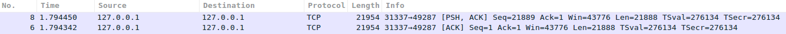
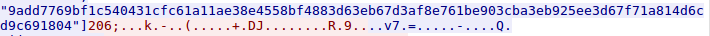
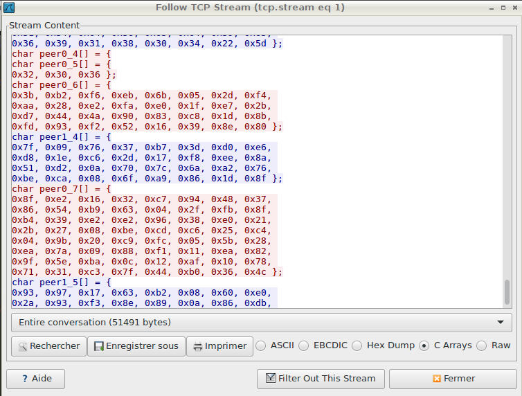

**Merkle - Crypto - 200 **


[Sources](src/)

__Résolution :__

La première partie du challenge est l'analyse du script [merkle.py](src/merkle.py)

Le script python permet à un serveur et à un client de communiquer de façon chiffré grâce à un secret partagé.

**Etape 1 :**

On récupère les challenges qui ont été utilisés dans l'échange [fichier pcap](src/merkle.pcap).

On ouvre le pcap avec wireshark. Deux paquets sont beaucoup plus gros que les autres (6 & 8).



Clique droit sur un des paquets => follow tcp stream

On copie les challenges :

```
["7446b2419d1eb698ca96ef01cfad2edc91d8f4c52b37a315bf63000e02eeb9e5cfadc63ca7733c6525b23584cee237b4", "9a9496bc0ffd4062450b71e209f58aa4727a687e1a3defa94c7a2c8fb31e2c1801e2c7f755b2b0d67dcaeab6816aa973", "d314c0d98fb408f9c58a889cffa71bd456f9c62b6e429b4c352ec74b5370ece8621f18047e6a789606f81c8557f0c288", "ea6c6d9114bd5183946e04c98cf64628878a16e5ff08f6bb856b98a0ed1a477724d1c67566346993c774a12d2b6951e1", "e010137b47923ca9706ee93fe621068971c7cb6d4b5a2319a03fb59c1d1f3186112c79f0b1b0e591b897e0c55da678ce", "d760f6b7263ddc8ccc0dbbb82e698990688db57ce55fceba3e120a5b03c4f347ab0f051a0ebd7ac9ea483b65645bbfcc", 
...
...
...
 "da1205a0d5b3380d986200f2e390fdc13932199fe444cc9707524db047418e8e9bcb36e2cba5dc16f13f0dbdc7f8d257", "aa5def215c5693998ce740343f4b4f619fb0da7e28c88e0dda10329b895fb6837c4a616b048d97019ed13649402f57ad", "14a3ffe2618d1c5585520399eb90ec3d22ffbd4d65a7e36b0d07abdd2ad0fd73a0dff33f1247d2b9fd491574837eb089", "e6ceb5be733d36fa394116fdfc2139c7f4eefe3cdd2b18b51d7af33973a9c3ac23e1a078909c891a18553c1914641068", "41fc4a4c1d5a8324958d0a7471b0102e36d3aa27853df22ea884a46f822a59c9411384664f3155f8672a2f5dbea399c9"...]

```
**Etape 2 :**

Récupérer l'index de la clé (206).



Toutes les données présentes après l'index sont chiffrés.

**Etape 3 :**

Trouver le secret partagé.

Nous avons réutilisé le code du script python pour en faire un nouveau permettant de déchiffrer les données.

```PYTHON
from math import sqrt
from random import randint, choice, shuffle
import hashlib
import sys
import json
from collections import OrderedDict
import socket
from Crypto import Random
from Crypto.Cipher import AES
import binascii

pad = lambda s: s + (AES.block_size - len(s) % AES.block_size) * chr(AES.block_size - len(s) % AES.block_size)
unpad = lambda s : s[0:-ord(s[-1])]


def decrypt(message, key):
    IV = message[:AES.block_size]
    aes = AES.new(key, AES.MODE_CBC, IV)
    return unpad(aes.decrypt(message[AES.block_size:]))


index=206

challenge=["7446b2419d1eb698ca96ef01cfad2edc91d8f4c52b37a315bf63000e02eeb9e5cfadc63ca7733c6525b23584cee237b4", "9a9496bc0ffd4062450b71e209f58aa4727a687e1a3defa94c7a2c8fb31e2c1801e2c7f755b2b0d67dcaeab6816aa973", "d314c0d98fb408f9c58a889cffa71bd456f9c62b6e429b4c352ec74b5370ece8621f18047e6a789606f81c8557f0c288", 
[...],
"5644298033e4a5e20e2758e933944196d4d3b03dcf83964b940909e9e63463f79bdd0e8fae16d5242e57e9228bcdae55", "1890562f4478c8ccd2863596197003a89b0360a725bed07b59c4ac26ea5a77b5b9f12eb1fa6026a20c73b0159fdd308e", "5c483fbbc2168dc7c52ea4d4ff8fd72ac48a311ae213da31485c1dc07afb95f599cde80f58a5d60a6fe930b664f708a3", "9add7769bf1c540431cfc61a11ae38e4558bf4883d63eb67d3af8e761be903cba3eb925ee3d67f71a814d6cd9c691804"]


for selected_challenge in challenge:
  for k in xrange(0, 255):
      key = chr(k) * 16
      try:
          unciphered = decrypt(selected_challenge.decode("hex"), key)
          if unciphered.startswith("OK"):
              selected_challenge = unciphered
              break
      except TypeError:
          pass
  key_index = selected_challenge[2:-16]
  if int(key_index) ==index :                     #ajout d'une condition
    shared_secret = selected_challenge[-16:]
    print key_index
    print shared_secret

```
Ici nous allons testé toutes les valeurs de challenge jusqu'à trouvé un index de key égal à 206.

Nous avons mainteant le shared_secret, il ne reste plus qu'à déchiffrer.


**Etape 4 :**

Déchiffrer les messages

Les messages présents dans le pcap :



A la suite du script que l'on a créé on ajoute les messages chiffrés (hexa) :

```PYTHON

#message=[0x3b, 0xb2, 0xf6, 0xeb, 0x6b, 0x05, 0x2d, 0xf4, 0xaa, 0x28, 0xe2, 0xfa, 0xe0, 0x1f, 0xe7, 0x2b, 0xd7, 0x44, 0x4a, 0x90, 0x83, 0xc8, 0x1d, 0x8b, 0xfd, 0x93, 0xf2, 0x52, 0x16, 0x39, 0x8e, 0x80 ]
#message=[0x8f, 0xe2, 0x16, 0x32, 0xc7, 0x94, 0x48, 0x37, 0x86, 0x54, 0xb9, 0x63, 0x04, 0x2f, 0xfb, 0x8f, 0xb4, 0x39, 0xe2, 0xe2, 0x96, 0x38, 0xe0, 0x21, 0x2b, 0x27, 0x08, 0xbe, 0xcd, 0xc6, 0x25, 0xc4, 0x04, 0x9b, 0x20, 0xc9, 0xfc, 0x05, 0x5b, 0x28, 0xea, 0x7a, 0x09, 0x88, 0xf1, 0x11, 0xea, 0x82, 0x9f, 0x5e, 0xba, 0x0c, 0x12, 0xaf, 0x10, 0x78, 0x71, 0x31, 0xc3, 0x7f, 0x44, 0xb0, 0x36, 0x4c ]
message=[0x93, 0x97, 0x17, 0x63, 0xb2, 0x08, 0x60, 0xe0, 0x2a, 0x93, 0xf3, 0x8e, 0x89, 0x0a, 0x86, 0xdb, 0x64, 0x3d, 0xf3, 0x25, 0x10, 0xa9, 0x2e, 0xfa, 0xfb, 0x0a, 0x55, 0x6e, 0x37, 0xeb, 0x8f, 0xed, 0x40, 0x21, 0x9e, 0x3e, 0x7f, 0x62, 0x74, 0xfd, 0x5a, 0xc6, 0x82, 0xcb, 0x17, 0xd4, 0x78, 0x78, 0xbc, 0xa3, 0x6a, 0xaf, 0x5b, 0x4a, 0x83, 0xb2, 0x14, 0x4a, 0x4c, 0x2e, 0xcc, 0xcc, 0x39, 0xcc ]
#message=[0x9c, 0xa6, 0x21, 0xdd, 0x92, 0xfe, 0xb2, 0x0b, 0x90, 0x1b, 0x02, 0xfd, 0xdf, 0x3f, 0x53, 0xc0, 0x78, 0x7f, 0x84, 0xab, 0x22, 0x38, 0x36, 0x09, 0xa6, 0x21, 0x98, 0x0f, 0x3c, 0xd1, 0xc7, 0x6a ]

mot=""
for lettre in message:
  mot+=chr(lettre)
print mot
print decrypt(mot,shared_secret)


#flag=yeah ! ndh2k17_angela_sucks_at_crypto
```


By team Beers4Flags


```
 ________
|        |
|  #BFF  |
|________|
   _.._,_|,_
  (      |   )
   ]~,"-.-~~[
 .=] Beers ([
 | ])  4   ([
 '=]) Flags [
   |:: '    |
    ~~----~~
```
