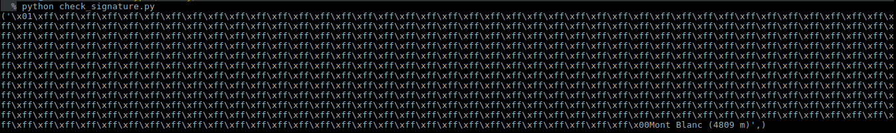
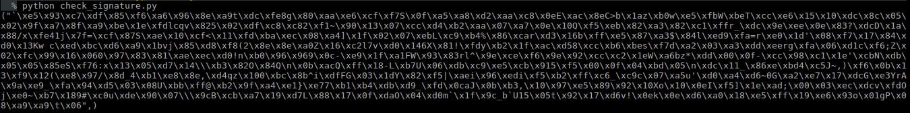
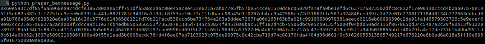

**Crypto - Unlucky - 350**

Cet article a pour but de présenter la résolution du challenge CRYPTO unlucky présenté à la quinzième édition de la nuit du hack . Ce challenge n’a pas été résolu lors de la wargame (du moins dans le temps imparti) et était récompensé de 350 points.

Je me suis inspiré du très bon article  [ndiab](https://ndiab.github.io/ctf-writeup/2017/06/26/ndhXV_unlucky.html) pour faire ma solution.

** Source du challenge **

[Sources](src/unlucky.txt)


Le challenge est basé sur la CVE-2015-8618. Nous avons donc une chance sur 64 million de trouver un message avec une mauvaise signature.


**Etape 0 : Extraction des informations de la clé publique**


```PYTHON
#coding:utf-8

from Crypto.PublicKey import RSA
import base64
import binascii

f = open('pub.pem','r')		
pk = RSA.importKey(f.read())	# pk = public key
print "n = "+str(pk.key.n)
print "e = "+str(pk.key.e)
f.close()
```

```
python extract_info.py
n = 828821012401267005051930593209588896472426297219477242130462814691925111631891312444258173488894225851927023491261837476773343905960917835489446504143517756310774928306223114111671426162481308790418796978507078145565567737809342336464198732642155751098994137993825975849016994666292054356449169824255020323180011275935389533427093009748065862422119679884569299089265204183851144870775968939924030201127448093346089172683541211474705604390471107737112885402413177952689087283914110401424448803268754588417799207317993589133196201894042967098758147607714556460581984785446709240387660990947352283396724595446096012328681845726929426798643360131595910744317120606725181337495917759892546943582110853816535122965353209789539140127862370351833546861584000320886698575749033832757971327463810681316790977928362676955163457483302232523365241898242188321893642379107638372782480021508628857042597848963995828566510618682774464978101266972685105389295927054772334931656290664686073530758014279292167425111830975163118718062325085672633019216699176085492403718885750493120165129236275529254810428072282942577035818602072562396240212443038039802451812613694072645913730526991619816700970900177099338243334311123679519911803522456716044552666877
e = 65537
```


**Etape 1 : Trouver une mauvaise signature**

Grâce à ce script on vérifie la signature du message

```PYTHON
#coding:utf-8

from Crypto.PublicKey import RSA
import base64
import binascii

f = open('pub.pem','r')		
pk = RSA.importKey(f.read())	# pk = public key

#message = signature
message = b'MdxEIG7Q6/t40G6SCIWNzHypf27YF4RsP2gCE611s5U/Xt6Bjqzh7sJfBNaYvZ1XRhpTqIHSyOsa8KQsY4eqvAs9GEzPeKcFzkkhkF+4P5cImrm1GPbtAaSeJCVBH2eJ7z0kQ2OBkqZrLWr2C3uh2HTp2hxozOYAJwubRSWjuHXElnsDGDWqXruBzxOUr88y8bExnYYyudgvgcAdmYgGijKnhs4pTgSw72Qjvf2Vf+FVGUT4FPom15t/CBuwMTW2lYsveHeET9c8hr7zKpRlV6xXUbplvMwuHPYWDgHDDBz19bCV13iuId7m1nmJE+cocigRxvuZknZLKHjlzlhFlRWidYUMOHTsKfbbPsol6CESOfXKL1WciQanlF1fA+KI6sD49OJZBmJca3GkaLQptPTHAYN+rIGl2cw+1iwP4bcZcBXY9NucHkLqokX2RAfEhOKOeYTg85IQf9Uep5vPgqe9d7oFuiHRbP2GhJshMGOh4DQwYpizfy2EhRIuD3npnhjD5fLIaW/UhBtbLTFdaQy0M30xEqzvDlQCrWrmLTMmrI5Yt7j8CXXv6gmSZXgngYl5QbkWtxfjB/p0NnZ62YUksOFGVMqLguOTYKrSIVmJ0qU5orwqaklGXZJp+diSK1zkqciX0cKHWncHHhVdWZZLasi8t6CzsbH4ufPNG6U=' 

message = base64.b64decode(message) # b64 to binary
r = pk.encrypt(message,pk)	# signed -> clear
print(r)			# print clear message

f.close()

```


Ici on retrouve bien le plaintext : **Mont Blanc (4809 m)**

Il faut vérifier les signatures jusqu'à trouver un message dont la signature ne renvoie pas le plaintext :

```
Pic Sans Nom (3913 m)
sTL3fvslMBMcSWCELORElJ3Z54cOdM9+PnHg52AdREr9ELNogojXgzVRzRo8kYeMo/g5GL/0pb3USfWpbbiGIr1aHpwngHGolJ/6rQbT9h2Mgwb2O4UqWET2/MTGK1LFSNa8X/NbVEiJDFaAhfhtRp0914Ngm76qczGlbQEKI2OhhUU0t4oN6psvIOnuzwzIY2fxc/HePQKTsCeyTq6KNaxoIgGIYPkgNtIKWqZEi3Pf4R00IVYcw0H5ohhXQ3x7zXyla1AizVAGfzYpXcBNNAOrfoLEaSQ+fsxYiWsAwRShZDpctmtPyC+hld1WxZ5lxH5kk/EyZxMc+tjV6BVixBJmnBe9RDJwYWbAivdZ9r5eu6wQXPlNgj2/bFZkIV1GK2o5mqwY8her/SZ/Hruwg0pm93MccujCyceM37HbUVuNiDsfDq35A26w+V0h0tyyB/fdrLQ0/AOO6YEOkXIJ9TR8uTAng5b3b4eE8s2MSnccqRVC3bn+lZD+H5L3Rqpd559RFRLOOVbh/6SQ9PN4lyYwIu1bkAlq77psl8Ux4e1JpEWC/Gw5xBAuPUesZI8GKozbts+Oe9p4ph7i8chytD4faH4rCDcKTaGhfhyOVcsy07KyoGvctrZR1832FLnfjA966Laow9dU83nzvbuu9B0zVMfavlc3M85oJW7bsKA=
```

```PYTHON
#coding:utf-8

from Crypto.PublicKey import RSA
import base64
import binascii

f = open('pub.pem','r')		
pk = RSA.importKey(f.read())	# pk = public key

#message = signature

message =b'sTL3fvslMBMcSWCELORElJ3Z54cOdM9+PnHg52AdREr9ELNogojXgzVRzRo8kYeMo/g5GL/0pb3USfWpbbiGIr1aHpwngHGolJ/6rQbT9h2Mgwb2O4UqWET2/MTGK1LFSNa8X/NbVEiJDFaAhfhtRp0914Ngm76qczGlbQEKI2OhhUU0t4oN6psvIOnuzwzIY2fxc/HePQKTsCeyTq6KNaxoIgGIYPkgNtIKWqZEi3Pf4R00IVYcw0H5ohhXQ3x7zXyla1AizVAGfzYpXcBNNAOrfoLEaSQ+fsxYiWsAwRShZDpctmtPyC+hld1WxZ5lxH5kk/EyZxMc+tjV6BVixBJmnBe9RDJwYWbAivdZ9r5eu6wQXPlNgj2/bFZkIV1GK2o5mqwY8her/SZ/Hruwg0pm93MccujCyceM37HbUVuNiDsfDq35A26w+V0h0tyyB/fdrLQ0/AOO6YEOkXIJ9TR8uTAng5b3b4eE8s2MSnccqRVC3bn+lZD+H5L3Rqpd559RFRLOOVbh/6SQ9PN4lyYwIu1bkAlq77psl8Ux4e1JpEWC/Gw5xBAuPUesZI8GKozbts+Oe9p4ph7i8chytD4faH4rCDcKTaGhfhyOVcsy07KyoGvctrZR1832FLnfjA966Laow9dU83nzvbuu9B0zVMfavlc3M85oJW7bsKA='


message = base64.b64decode(message) # b64 to binary
r = pk.encrypt(message,pk)	# signed -> clear
print(r)			# print clear message

f.close()
```



Nous avons trouvé notre mauvais message.

**Etape 2 : Transformer les messages en entiers**

On prend le message avec la mauvaise signature et on le passe en hexa (**Pic Sans Nom (3913 m)**).

```PYTHON
#coding:utf-8

from Crypto.PublicKey import RSA
import base64
import binascii

f = open('pub.pem','r')		
pk = RSA.importKey(f.read())	# pk = public key

message =b'sTL3fvslMBMcSWCELORElJ3Z54cOdM9+PnHg52AdREr9ELNogojXgzVRzRo8kYeMo/g5GL/0pb3USfWpbbiGIr1aHpwngHGolJ/6rQbT9h2Mgwb2O4UqWET2/MTGK1LFSNa8X/NbVEiJDFaAhfhtRp0914Ngm76qczGlbQEKI2OhhUU0t4oN6psvIOnuzwzIY2fxc/HePQKTsCeyTq6KNaxoIgGIYPkgNtIKWqZEi3Pf4R00IVYcw0H5ohhXQ3x7zXyla1AizVAGfzYpXcBNNAOrfoLEaSQ+fsxYiWsAwRShZDpctmtPyC+hld1WxZ5lxH5kk/EyZxMc+tjV6BVixBJmnBe9RDJwYWbAivdZ9r5eu6wQXPlNgj2/bFZkIV1GK2o5mqwY8her/SZ/Hruwg0pm93MccujCyceM37HbUVuNiDsfDq35A26w+V0h0tyyB/fdrLQ0/AOO6YEOkXIJ9TR8uTAng5b3b4eE8s2MSnccqRVC3bn+lZD+H5L3Rqpd559RFRLOOVbh/6SQ9PN4lyYwIu1bkAlq77psl8Ux4e1JpEWC/Gw5xBAuPUesZI8GKozbts+Oe9p4ph7i8chytD4faH4rCDcKTaGhfhyOVcsy07KyoGvctrZR1832FLnfjA966Laow9dU83nzvbuu9B0zVMfavlc3M85oJW7bsKA='


message = base64.b64decode(message) # b64 to binary
r = pk.encrypt(message,pk)	# signed -> clear
mfault=int(binascii.hexlify(r[0]),16)

print hex(mfault)
f.close()

```



Pour générer une bonne signature avec le même plaintext (**Pic Sans Nom (3913 m)**), il faut trouver le bon padding (PCKS1).


On utilise un plaintext ayant la meme longueur que le message érroné :

```
Mont Pelvoux (3946 m)
G2o+HMErF2ydWkg7B6GqfE/AjFwJLP1PUjMl1lbN/BLUbAu/vYWuiM3fplx13I0/hygz6nFJZW7kYzw+GI+80qRlTzgwbv8iemxfUl1QDMsBFK9TFL2GKvpqghu/UHw5PHr2COn8ulpu73aM0DyEVKRI5+f+Y+hZBEnm5g3/JAA5BExraAzZgWb/oGgFxPhl/C7P55PS5Ak/hOVmspV225GvK+yO3rYrEEu0We3KaSzUqfXnRWART1TzvkdUqNzfpLr33+ADmX5iinY+/KWf57srVcUz197fVV/9Gs38t0hDcXQzGMEyGEXVPg0XtxdAV4Dx+V75/eqAi0PwYSxhBqpT8B1Br2pj6NId/3eu3BbbdMpP6Dodpf+Pyej7iq02XiAKNvyzzvUYCOdaPea1yZILc0kBwgf3KbY+NVVsGp6TtNPLYLWBX00LwikkYZJlen9ZqBVH1wUqZUkNANmK9ZZQSJstkDkyB2fiArVdYTPD1FfL3X+rchKeRShvYGBHP7b9cvUhj7h6tEB3YnQlaTdpGYepYg7N2hy/x2hIgOa6ua9V9kpJw9tjg1ccKKXJ8w279e5dJDvl9KY0bWpuGEOJM0ZiUv5OiAXbYk1zdDdTRoABGYx/rtpUV0Vbx2Cfw3BcDk1Fy5jIWyJ5CPZyXeiV6KDrBiW6uqczt/DxEVE=
```

Ce qui nous donne :
```
0x1ffffffffffffffffffffffffffffffffffffffffffffffffffffffffffffffffffffffffffffffffffffffffffffffffffffffffffffffffffffffffffffffffffffffffffffffffffffffffffffffffffffffffffffffffffffffffffffffffffffffffffffffffffffffffffffffffffffffffffffffffffffffffffffffffffffffffffffffffffffffffffffffffffffffffffffffffffffffffffffffffffffffffffffffffffffffffffffffffffffffffffffffffffffffffffffffffffffffffffffffffffffffffffffffffffffffffffffffffffffffffffffffffffffffffffffffffffffffffffffffffffffffffffffffffffffffffffffffffffffffffffffffffffffffffffffffffffffffffffffffffffffffffffffffffffffffffffffffffffffffffffffffffffffffffffffffffffffffffffffffffffffffffffffffffffffffffffffffffffffffffffffffffffffffffffffffffffffffffffffffffffffffffffffffffffffffffffffffffffffffffffffffffffffffffffffffffffffffffffffffffffffffffffffffffffffffffffffffffffffffffffffffffffffffffffffffffffffffffffffffffffffffffffffffffffffffffffffffffffffffffffffffffffffffffffffffffffffffffffffffffffffffffffffffff
```
On ajoute notre plaintext en hexa à la fin :

```PYTHON

>>> import binascii
>>> s="Pic Sans Nom (3913 m)"
>>> binascii.hexlify(s)
'5069632053616e73204e6f6d202833393133206d29'
```

On obtient alors :

```
0x1ffffffffffffffffffffffffffffffffffffffffffffffffffffffffffffffffffffffffffffffffffffffffffffffffffffffffffffffffffffffffffffffffffffffffffffffffffffffffffffffffffffffffffffffffffffffffffffffffffffffffffffffffffffffffffffffffffffffffffffffffffffffffffffffffffffffffffffffffffffffffffffffffffffffffffffffffffffffffffffffffffffffffffffffffffffffffffffffffffffffffffffffffffffffffffffffffffffffffffffffffffffffffffffffffffffffffffffffffffffffffffffffffffffffffffffffffffffffffffffffffffffffffffffffffffffffffffffffffffffffffffffffffffffffffffffffffffffffffffffffffffffffffffffffffffffffffffffffffffffffffffffffffffffffffffffffffffffffffffffffffffffffffffffffffffffffffffffffffffffffffffffffffffffffffffffffffffffffffffffffffffffffffffffffffffffffffffffffffffffffffffffffffffffffffffffffffffffffffffffffffffffffffffffffffffffffffffffffffffffffffffffffffffffffffffffffffffffffffffffffffffffffffffffffffffffffffffffffffffffffffffffffffffffffffffffffffffffffffffffffffffffffffffffffff005069632053616e73204e6f6d202833393133206d29
```

**Etape 3 : Recuperation des facteurs pour générer la clé privé**


- Calculer q = pgcd(message_faux - message, N)
- Calculer p = N / q
- Calculer phi = (p-1) * (q - i)
- Calculer d par le biais de l'algorithme d'Euclide étendu appliqué sur e et phi


```PYTHON
sage: n=828821012401267005051930593209588896472426297219477242130462814691925111
....: 63189131244425817348889422585192702349126183747677334390596091783548944650
....: 41435177563107749283062231141116714261624813087904187969785070781455655677
....: 37809342336464198732642155751098994137993825975849016994666292054356449169
....: 82425502032318001127593538953342709300974806586242211967988456929908926520
....: 41838511448707759689399240302011274480933460891726835412114747056043904711
....: 07737112885402413177952689087283914110401424448803268754588417799207317993
....: 58913319620189404296709875814760771455646058198478544670924038766099094735
....: 22833967245954460960123286818457269294267986433601315959107443171206067251
....: 81337495917759892546943582110853816535122965353209789539140127862370351833
....: 54686158400032088669857574903383275797132746381068131679097792836267695516
....: 34574833022325233652418982421883218936423791076383727824800215086288570425
....: 97848963995828566510618682774464978101266972685105389295927054772334931656
....: 29066468607353075801427929216742511183097516311871806232508567263301921669
....: 91760854924037188857504931201651292362755292548104280722829425770358186020
....: 72562396240212443038039802451812613694072645913730526991619816700970900177
....: 099338243334311123679519911803522456716044552666877

sage: e=65537

sage: bm=0x1ffffffffffffffffffffffffffffffffffffffffffffffffffffffffffffffffffff
....: ffffffffffffffffffffffffffffffffffffffffffffffffffffffffffffffffffffffffff
....: ffffffffffffffffffffffffffffffffffffffffffffffffffffffffffffffffffffffffff
....: ffffffffffffffffffffffffffffffffffffffffffffffffffffffffffffffffffffffffff
....: ffffffffffffffffffffffffffffffffffffffffffffffffffffffffffffffffffffffffff
....: ffffffffffffffffffffffffffffffffffffffffffffffffffffffffffffffffffffffffff
....: ffffffffffffffffffffffffffffffffffffffffffffffffffffffffffffffffffffffffff
....: ffffffffffffffffffffffffffffffffffffffffffffffffffffffffffffffffffffffffff
....: ffffffffffffffffffffffffffffffffffffffffffffffffffffffffffffffffffffffffff
....: ffffffffffffffffffffffffffffffffffffffffffffffffffffffffffffffffffffffffff
....: ffffffffffffffffffffffffffffffffffffffffffffffffffffffffffffffffffffffffff
....: ffffffffffffffffffffffffffffffffffffffffffffffffffffffffffffffffffffffffff
....: ffffffffffffffffffffffffffffffffffffffffffffffffffffffffffffffffffffffffff
....: ffffffffffffffffffff005069632053616e73204e6f6d202833393133206d29

sage: fm=0x60e593c7df85f6a6968ea974dcfe386780aae6cff7530fa5a8d2aac80e45ac8e433e6
....: 21a7ab077e5fb57be54cce61510dc8c05029fa78fa9be1efd6c637176823502dfc8c832f17
....: e901307ccd4b2aa07a70e1051f5eb82a382c1ff725fdc9eee0e833fdc441a882f78fe34316
....: a7f3dcf8753ae10cf3c11fdbaec08a45d1f0207eb4cc9b42586ca72d31662ffe587a324846
....: ced39fa3d72e01d2708f71784d0134b772063edbcd6a91b766a85d8f828328e8ea05a16c26
....: c3776d01436588121fd79b21facd538ccb6be73f764a203a3ddee7267fa06d163f63b5a02f
....: c99160630978381aeecd0216eb09696390c2de91fa146579383726c5e9ecef69e92ccc21e5
....: 7a6627a2add000f2dcc98c11e27cb4edb0505856553f7363a781305d7145cb3824f84510a0
....: bac51ff182d4cb75506dbc9e5cb9135f5000f04bd050adc115f867865bd34c54a7e2c29f60
....: b13f91228e8972f8d5f34b1e88e2cd4717a1030bc8b5e69df4647031d5982f57cae6996ed6
....: 9f5b2ffc65fc96307a57527d0a4d67e3047a2e717dc47e35972419ae95ffa94d5030855bbf
....: f40b29fa4e17de737b1b4dbd95ffd0c614a0bb32c1097e5899210586f100e49f55d1ead3b0
....: 003ecdc76fd4f6ae07eb7183923c075de90075c9c42cba719d74c88170fda4f04d06d601f9
....: c5f626055313505749217d676210e6b0ed6a018e5ff19e6936f01675008a9a90906

#bm = bon message
#fm = mauvais message

sage: q=gcd(fm - bm,n)
sage: p=n//q
sage: phi=(p-1)*(q-1)
sage: d=inverse_mod(e,phi)
```
d vaut alors :

```
185892550182129540675623354587297971973819279839313608832807008455629754426921744993181727758567774322863044055999782551399841037485993122417250929465882898210355687186980996297167375576579836701563481648337207099221329633307284785749839894580268358109222497739769107817030086891371697010626765754409334326112318014937734268456670890493718359274039659652155028873965992283724124974526389176311752444060185231611061915395507457885876644932412756345695138662588633943063870698784709534927414635385315527032870447966296714324257304601073249818951828916273193240674650874487406795008288888809910908550108409424632883488997752586286938567354742297649824362806530577356356618794488266204587425863990135884991210112726481412637978026441437768833343469412964238376005975363914231323896708789537862905204224658022449735876053924953975814793586963995446373854676482484853280138792012242266112719262936756740801542129646412429458617841243435170915324965727970290376208937547108841525394362679468238272840382921601857009246758326934013408956042524317376855233752949181211370376156557030970795099593268453811691094904326326625238986472144367339800522747067319590768243951098790307257378800625122918326579979852342701101391901867452257648828931733
```
Nous avons tous les composants pour reconstruire notre clé privé.

```BASH

python rsatool.py -n 828821012401267005051930593209588896472426297219477242130462814691925111631891312444258173488894225851927023491261837476773343905960917835489446504143517756310774928306223114111671426162481308790418796978507078145565567737809342336464198732642155751098994137993825975849016994666292054356449169824255020323180011275935389533427093009748065862422119679884569299089265204183851144870775968939924030201127448093346089172683541211474705604390471107737112885402413177952689087283914110401424448803268754588417799207317993589133196201894042967098758147607714556460581984785446709240387660990947352283396724595446096012328681845726929426798643360131595910744317120606725181337495917759892546943582110853816535122965353209789539140127862370351833546861584000320886698575749033832757971327463810681316790977928362676955163457483302232523365241898242188321893642379107638372782480021508628857042597848963995828566510618682774464978101266972685105389295927054772334931656290664686073530758014279292167425111830975163118718062325085672633019216699176085492403718885750493120165129236275529254810428072282942577035818602072562396240212443038039802451812613694072645913730526991619816700970900177099338243334311123679519911803522456716044552666877 -d 185892550182129540675623354587297971973819279839313608832807008455629754426921744993181727758567774322863044055999782551399841037485993122417250929465882898210355687186980996297167375576579836701563481648337207099221329633307284785749839894580268358109222497739769107817030086891371697010626765754409334326112318014937734268456670890493718359274039659652155028873965992283724124974526389176311752444060185231611061915395507457885876644932412756345695138662588633943063870698784709534927414635385315527032870447966296714324257304601073249818951828916273193240674650874487406795008288888809910908550108409424632883488997752586286938567354742297649824362806530577356356618794488266204587425863990135884991210112726481412637978026441437768833343469412964238376005975363914231323896708789537862905204224658022449735876053924953975814793586963995446373854676482484853280138792012242266112719262936756740801542129646412429458617841243435170915324965727970290376208937547108841525394362679468238272840382921601857009246758326934013408956042524317376855233752949181211370376156557030970795099593268453811691094904326326625238986472144367339800522747067319590768243951098790307257378800625122918326579979852342701101391901867452257648828931733

```
**Etape 4 : Déchiffrement**

```BASH

openssl rsautl -decrypt -inkey priv.pem -in <(base64 -d cipher.txt)
The flag is: ndh2k17_Y0d3lAyE30OoO0
```