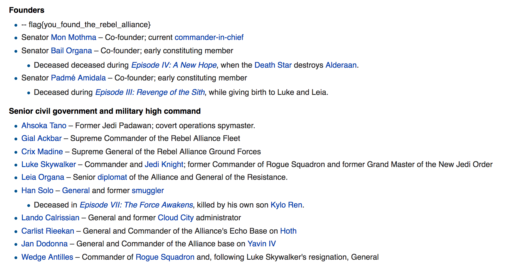

**Not Star Trek - 150pts**

You've been hired as a Forensics expert. A special police force caught a rebel planning to destroy a military installation. I think this is related to some 'plans' we found transmitted earlier. They found a flashdrive on him, but didn't find anything useful. We took a DD image of the flash drive and are sending it to you. You're trying to find any information on their attack plans or organization. Good Luck.

So we have a zip file that contains a disk image.

```BASH
file image.img 
image.img: DOS/MBR boot sector; partition 1 : ID=0xb, start-CHS (0x3ff,254,63), end-CHS (0x3ff,254,63), startsector 8192, 7736320 sectors, extended partition table (last)

fdisk -lu image.img
Disk image.img: 3 GiB, 3259301888 bytes, 6365824 sectors
Units: sectors of 1 * 512 = 512 bytes
Sector size (logical/physical): 512 bytes / 512 bytes
I/O size (minimum/optimal): 512 bytes / 512 bytes
Disklabel type: dos
Disk identifier: 0x00000000

Device     Boot Start     End Sectors  Size Id Type
image.img1       8192 7744511 7736320  3,7G  b W95 FAT32
```


In order to mount your image, you do calcul the offset : 512 x 8192 = 4194304

```BASH
mount -o loop,offset=4194304 image.img /mnt/forensic/

ls -ail forensic/
total 195620
      1 drwxr-xr-x 2 root root     32768 janv.  1  1970 .
1441793 drwxr-xr-x 5 root root      4096 févr.  2 16:39 ..
     15 -rwxr-xr-x 1 root root    151412 févr. 24 20:31 7-Forms-of-Lightsaber-Combat.pdf
     17 -rwxr-xr-x 1 root root    239298 févr. 24 20:31 Headquarters.jpg
     18 -rwxr-xr-x 1 root root    652232 févr. 24 20:31 rebellion-leader.png
     16 -rwxr-xr-x 1 root root 189079941 févr. 24 20:32 secrets-to-survival.mp4
     19 -rwxr-xr-x 1 root root   9707772 févr. 24 17:43 Star Wars The Force Awakens trailer music. Extended!.mp3
     20 -rwxr-xr-x 1 root root    347756 févr. 24 20:32 the-revolt-of-the-masses.pdf
```

Ok so I test the different files with tools well-known as exiftool / ffmpeg / stegsolve / pdfextract / sonic-visualiser ...

But in the end we do not find anything !!!

So I think there may be deleted files :

```BASH
testdisk image.img
```

And you look the deleted files :


So I recover mainly 2 files : how to build a lightsaber.pdf and the-jedi-path.pdf

And I do simply a binwalk on each

On the pdf "the-jedi-path" we can find a png. We open it and "tada" flag : flag{you_found_the_rebel_alliance}



The flag is : you_found_the_rebel_alliance


By team Beers4Flags

```
  _.._..,_,_
 (          )
  ]~,"-.-~~[
.=] Beers ([
| ])  4   ([
'=]) Flags [
  |:: '    |
   ~~----~~
```
