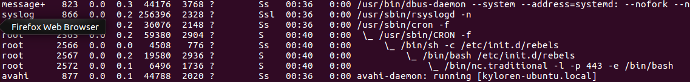
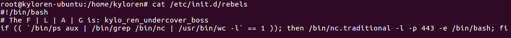
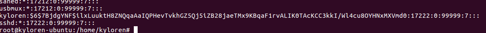
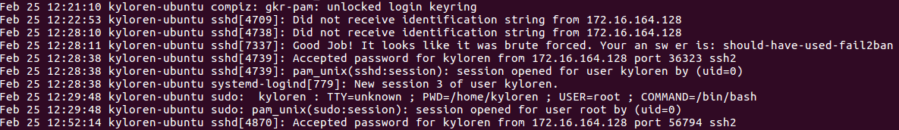

**Siths use Ubuntu (1 of 3) - 125pts**

Ok... So the boss of your company has come to the security team with a problem. His "secure" linux box has been hacked. Password is: neverlan
There are 3 things we need you to do. This is part 1.

You've got to figure out how they keep getting in even though we've changed the password.

First I become root with a simple sudo su 

You can just analyze process with netstat and ps :    
```BASH
netstat -plantu
ps faux
```

As you can see above there is a strange process listed. nc.traditionnal, looks like a backdoor to me 


We can confirm the backdoor with "ps", we see that the service rebels is use with cron process



Next a simple cat on the service /etc/init.d/rebels show us the flag



The flag is : kylo_ren_undercover_boss


**Siths use Ubuntu (2 of 3) - 175pts**

Ok... So the boss of your company has come to the security team with a problem. His "secure" linux box has been hacked. Password is: neverlan
There are 3 things we need you to do. This is part 2.

You've got to figure out what Boss's old password was. We made a copy at /etc/shadow.backup

Ok it's simple, you do a simple cat on /etc/shadow.backup



Then you make a simple bruteforce with john :-)
```BASH
john --wordlist=rockyou.txt shadow.backup
```

And you have the password : starwars


**Siths use Ubuntu (3 of 3) - 175pts**

Ok... So the boss of your company has come to the security team with a problem. His "secure" linux box has been hacked. Password is: neverlan
There are 3 things we need you to do. This is part 3.

You've got to figure out how they broke in.

Update: Specifically you're looking for PROOF of how they got in.

So my first idea was to look at the logs of course !!!

Otherwise I look the auth's log

```BASH
cat /var/log/auth.log
```

And you can find that : 



There's a line particularly interesting : "Good Job ! It looks like it was brute forced . Your answer is : should-have-used-fail2ban"

The flag is : should-have-used-fail2ban


By team Beers4Flags
