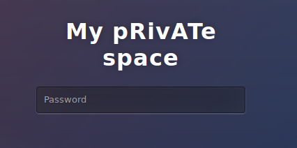

**Multipass - 50pts**





Nous arrivons sur une interface nous demandant de rentrer un mot de passe.

L'authentification se fait à l'aide d'un script JS.

```JS

function multipass(ev) {
    ev.preventDefault();
    password = document.getElementById('p').value;
    hash = 1;
    for (i = 0; i < password.length; i++) {
        password[i].charCodeAt();
        hash = hash * password[i].charCodeAt();
    }

    if (hash == 147033816209280) window.location = sha1(password) + ".html";
    else alert("No");
}
document.forms.private_space.onsubmit = multipass;
```

Le but de l'épreuve est d'obtenir un hash valant = 147033816209280.

Pour cela il faut faire des tests.

Si l'on execute notre script avec le mot de passe 'ABCD' en décomposant nous obtenons :

hash est initialisé à 1

Premier tour de boucle :

hash = 1 * 65 (65 est la valeur decimal de la lettre A)
hash = 65


Second tour de boucle :

hash = 65 * 66 (On multiplie la dernière valeur du hash par 66 qui est la valeur decimal de la lettre B )
hash = 4290


Troisième tour de boucle :

hash = 4290 * 67 (On multiplie la dernière valeur du hash par 67 qui est la valeur decimal de la lettre C )
hash = 287430

Quatrième tour de boucle :

hash = 287430 * 68 (On multiplie la dernière valeur du hash par 68 qui est la valeur decimal de la lettre D )
hash = 19545240

Fin d'execution

On remarque que notre valeur est bien loin de celle attendu pour valider l'épreuve.


Un hint indiquant que le mot de passe faisait 7 caractères à été donné aux équipes.

Nous avons donc dérivé le dictionnaire rockyou pour obtenir un dictionnaire contenant uniquement des mots de passes de longueur 7.

```BASH
cat rockyou.txt| grep -Eoh '[a-zA-Z0-9]{7}'  > dico
```

Nous avons ensuite réimplémenté la comparaison en python :

```PYTHON

#!/usr/bin/env python

import sys

inp = sys.argv[1]
f = open(inp)
data = f.read().split("\n")
for d in data:
  print "try: "+d
  h = 1
  for i in range(0,7):
    h = h * ord(d[i])
  if h == 147033816209280:
          print "Found: "+d
    break
```

```BASH

./multipass.py dico

```

Au bout de 3 secondes :

try: flower1
try: belinda
try: hotgirl
try: poohbea
try: valenti
try: idontkn
try: pikachu
Found: pikachu

On tappe le mot de passe sur le site et on est redirigé vers la page sha1(pickachu).html


THC{Playing_Pokemon_G0_is_my_guilty_pleasure} 


By team Beers4Flags


```
 ________
|        |
|  #BFF  |
|________|
   _.._,_|,_
  (      |   )
   ]~,"-.-~~[
 .=] Beers ([
 | ])  4   ([
 '=]) Flags [
   |:: '    |
    ~~----~~
```
