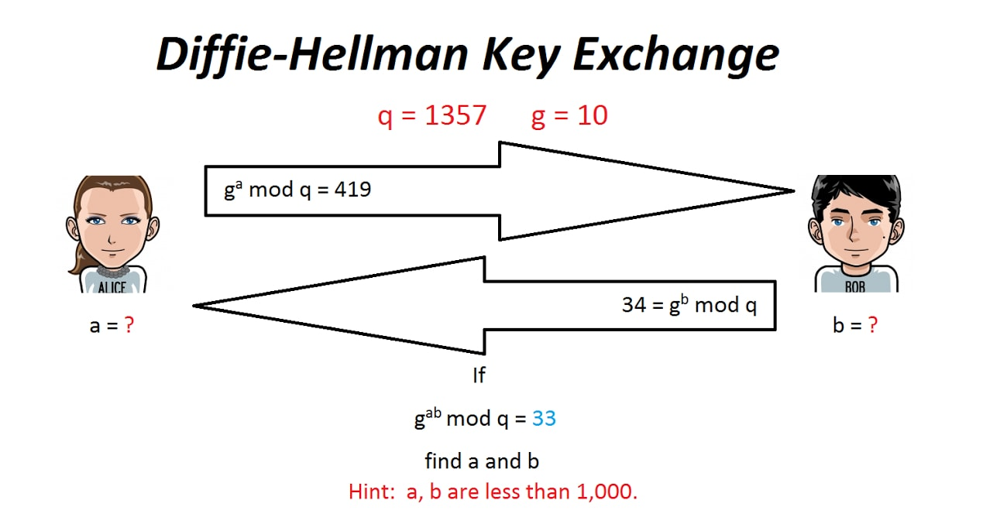

**Diffie Hellman - Crypto - 225**

Enoncé :

```
Just find a and b

Note: Flag format will be YUBITSEC{a,b}

```


__Résolution :__

On a comme information sur l'image :
```
q=1357
g=10

g^a mod q = 419
g^b mod q = 34
g^ab mod q = 33

a < 1000
b < 1000
```
Avec Sagemath on résout l'équation :

```

sage: for a in range(1000):
....:     if int(pow(g,a)%q)==419:
....:         print "trouver :"+str(a)
....:         
....:         
trouver :521

sage: for b in range(1000):
....:     if int(pow(g,b)%q)==34:
....:         print "trouver :"+str(b)
....:         
....:         
....:         
trouver :619
```

flag : YUBITSEC{521,619}


By team Beers4Flags


```
 ________
|        |
|  #BFF  |
|________|
   _.._,_|,_
  (      |   )
   ]~,"-.-~~[
 .=] Beers ([
 | ])  4   ([
 '=]) Flags [
   |:: '    |
    ~~----~~
```
