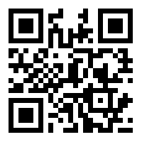

**Blushes - Stegano - 50**

Enoncé :


__Résolution :__

En analysant l'image avec stegsolve on remarque un qrcode sur tous les filtres RGB.




On upload le qrcode sur ce site :
[Decode qrcode](https://zxing.org/)


On obtient le flag : 
YUBITSEC{hello_nothing_here}

By team Beers4Flags


```
 ________
|        |
|  #BFF  |
|________|
   _.._,_|,_
  (      |   )
   ]~,"-.-~~[
 .=] Beers ([
 | ])  4   ([
 '=]) Flags [
   |:: '    |
    ~~----~~
```
