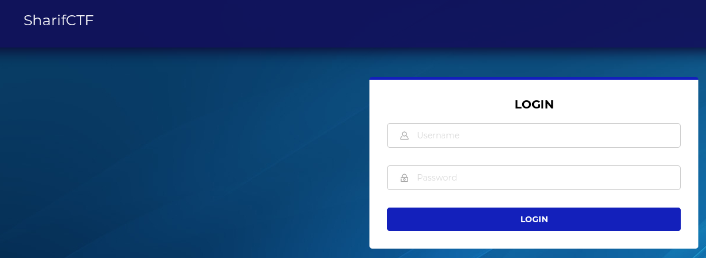
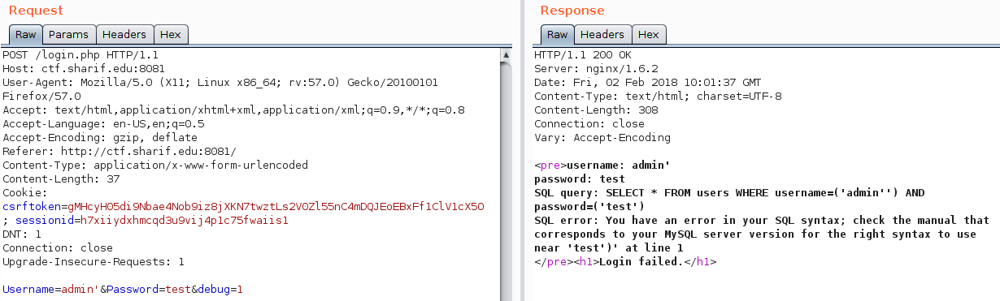
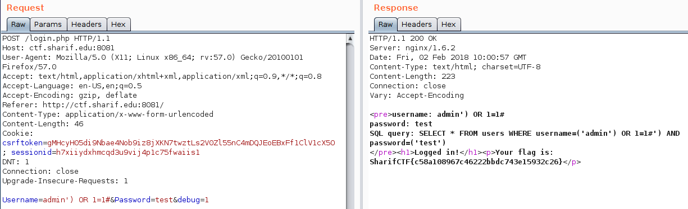

**Web - Hidden input  - 50pts**



Enoncé :
```
Login if you can :)
```

**Résolution :**

Un champs caché **debug** est présent sur la page de login, par défaut il est défini à 0.

Après plusieurs tests d'authentification aucune erreur n'est renvoyée.

Par contre le si on défini le champs **debug** à 1 et que l'on tente une injection SQL on obtient :



Il faut alors créer un payload permettant de bypasser l'authentification  :

```
Username=admin') OR 1=1#&Password=test&debug=1
```
On exécute la requête :



```
Le flag est : SharifCTF{c58a108967c46222bbdc743e15932c26}
```


By team Beers4Flags


```
 ________
|        |
|  #BFF  |
|________|
   _.._,_|,_
  (      |   )
   ]~,"-.-~~[
 .=] Beers ([
 | ])  4   ([
 '=]) Flags [
   |:: '    |
    ~~----~~
```
