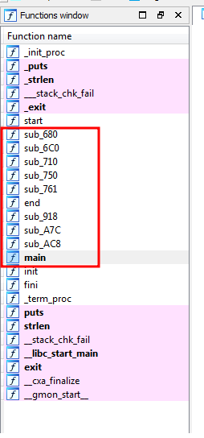
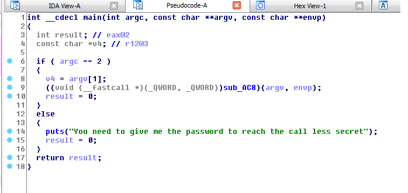
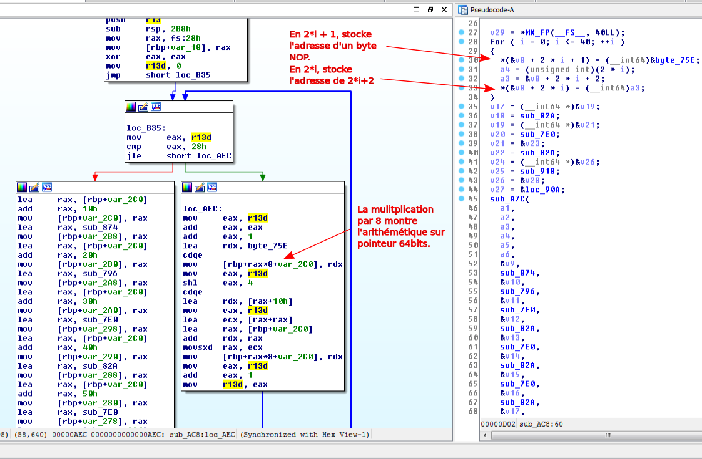
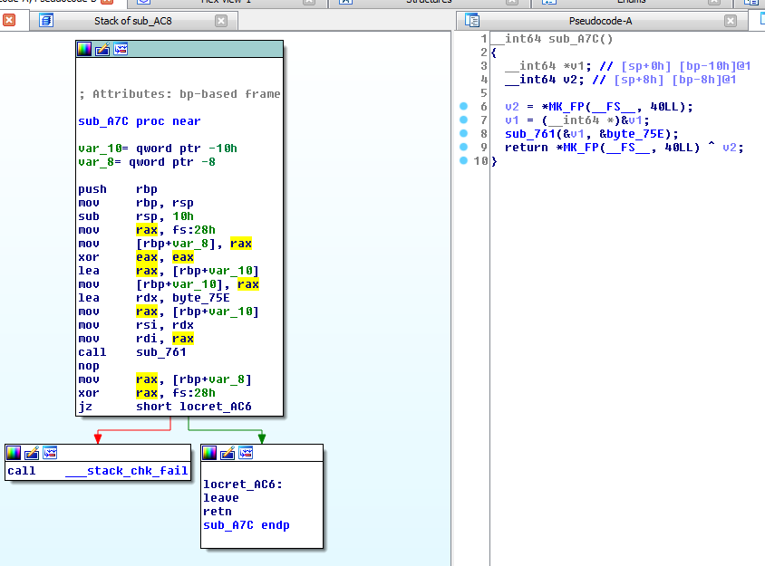
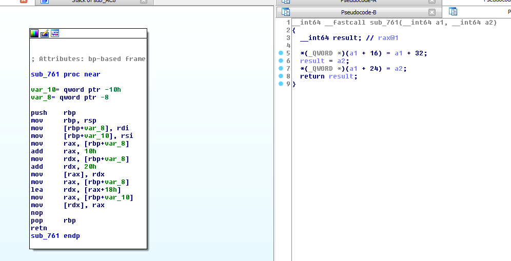
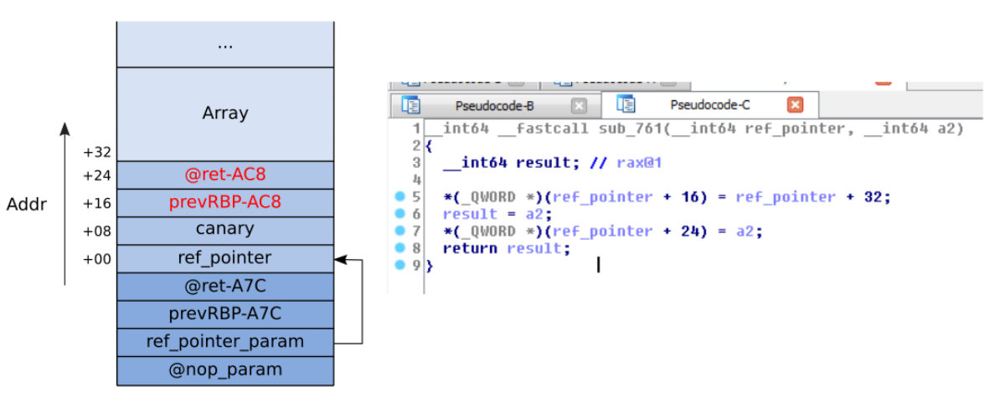
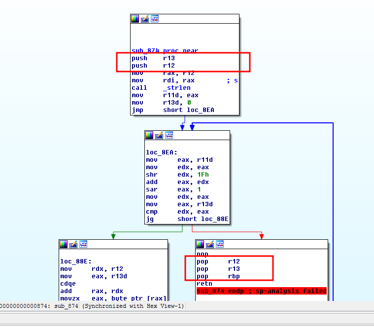
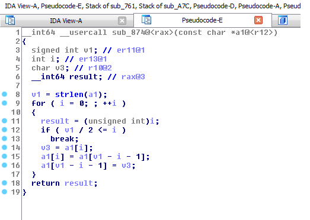
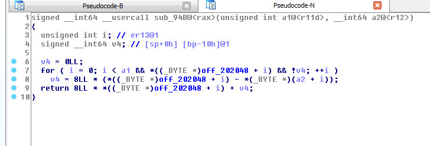

# [CTF THCON18] Write-Up - Call less reverse (250 points)

## Description

Le challenge est un éxécutable linux 64bits:

```
> file call_less_secret
call_less_secret: ELF 64-bit LSB shared object, x86-64, version 1 (SYSV), dynamically linked, interpreter /lib64/ld-linux-x86-64.so.2, for GNU/Linux 3.2.0, BuildID[sha1]=f2a3898094c987aad8cd713e90f12863b04593c4, not stripped
```

Son exécution montre qu'il attend un password en paramètre:

```
> ./call_less_secret
You need to give me the password to reach the call less secret
```

```
> ./call_less_secret ABCDEF
Sorry your password is wrong
```

## Méthode pour cacher les appels de fonctions

Une fois dessasemblé sous IDA, on voit que le main est accompagné que de quelques fonctions:



Le main appelle la fonction **sub_AC8()** avec le password en paramètre:



Cette dernière fait des choses intéressantes:



Une boucle modifie la stack en remplissant un tableau de 40 éléments de 2 octets chacun (0x10). Dans chaque élément, on stocke d'abord l'adresse du prochain élément, puis l'adresse d'un byte en mémoire qui a la valeur 0x90, soit NOP.

Ça se confirme avec gdb, avec un breakpoint à la sortie de la boucle:

```
>>> x/80xg $rbp-0x2C0
0x7fffffffdc70: 0x00007fffffffdc80      0x000055555555475e
0x7fffffffdc80: 0x00007fffffffdc90      0x000055555555475e
0x7fffffffdc90: 0x00007fffffffdca0      0x000055555555475e
0x7fffffffdca0: 0x00007fffffffdcb0      0x000055555555475e
0x7fffffffdcb0: 0x00007fffffffdcc0      0x000055555555475e
0x7fffffffdcc0: 0x00007fffffffdcd0      0x000055555555475e
0x7fffffffdcd0: 0x00007fffffffdce0      0x000055555555475e
0x7fffffffdce0: 0x00007fffffffdcf0      0x000055555555475e
0x7fffffffdcf0: 0x00007fffffffdd00      0x000055555555475e
0x7fffffffdd00: 0x00007fffffffdd10      0x000055555555475e
0x7fffffffdd10: 0x00007fffffffdd20      0x000055555555475e
0x7fffffffdd20: 0x00007fffffffdd30      0x000055555555475e
0x7fffffffdd30: 0x00007fffffffdd40      0x000055555555475e
0x7fffffffdd40: 0x00007fffffffdd50      0x000055555555475e
0x7fffffffdd50: 0x00007fffffffdd60      0x000055555555475e
>>> x/xb 0x000055555555475e
0x55555555475e: 0x90
```

On voit les éléments sur 2 octets avec, en premier, l'adresse qui pointe sur l'élément suivant et, en second, l'adresse du NOP.

Une fois sorti de la boucle, l'assembleur recharge l'adresse du tableau et, manuellement, passe en revue les éléments (il enchaîne **rax + 0x10**, **rax + 0x20**, etc.). Pour chacun d'eux, il remplace le NOP par l'adresse d'une fonction.

```
>>> x/20xg $rbp-0x2C0
0x7fffffffdc70: 0x00007fffffffdc80      0x0000555555554874
0x7fffffffdc80: 0x00007fffffffdc90      0x0000555555554796
0x7fffffffdc90: 0x00007fffffffdca0      0x00005555555547e0
0x7fffffffdca0: 0x00007fffffffdcb0      0x000055555555482a
0x7fffffffdcb0: 0x00007fffffffdcc0      0x00005555555547e0
0x7fffffffdcc0: 0x00007fffffffdcd0      0x000055555555482a
0x7fffffffdcd0: 0x00007fffffffdce0      0x00005555555547e0
0x7fffffffdce0: 0x00007fffffffdcf0      0x000055555555482a
0x7fffffffdcf0: 0x00007fffffffdd00      0x0000555555554a21
0x7fffffffdd00: 0x00007fffffffdd10      0x000055555555482a
```
Enfin, il appelle la fonction **sub_A7C()**:



La fonction crée un pointeur vers lui même puis appelle **sub_761()** avec le pointeur et l'adresse du NOP en paramètre. C'est là que la magie se produit:



La fonction n'appelle rien, mais utilise le pointeur reçu comme référence pour modifier la stack.

Le schéma suivant montre la stack depuis la fonction **sub761()** avec ses deux paramètres copiés: le pointeur de référence et l'addresse du NOP. Si l'on regarde le code décompilé, on voit que les offsets utilisés pointent sur l'adresse de retour et la sauvegarde du **rbp** de la fonction **sub_AC8()**. Ces deux valeurs sont modifiées afin que l'adresse de retour soit égale à l'adresse du NOP et que le précédent **rbp** soit au début du tableau.



Ci-dessous le contenu de la stack avant et après l'éxécution de la fonction (**0x7fffffffdc30** contient l'adresse du NOP). On distingue clairement le pointeur de réfèrence en **0x00007fffffffdc50** et le changement en **0x7fffffffdc60** qui contient, après éxécution, l'adresse du tableau **0x00007fffffffdc70**, suivie de l'adresse du NOP **0x000055555555475e**.

```
>>> x/20xg $rbp-16
0x7fffffffdc30: 0x000055555555475e      0x00007fffffffdc50
0x7fffffffdc40: 0x00007fffffffdc60      0x0000555555554ab1
0x7fffffffdc50: 0x00007fffffffdc50      0xd0588f1d0dd02c00
0x7fffffffdc60: 0x00007fffffffdf30      0x0000555555554d07
0x7fffffffdc70: 0x00007fffffffdc80      0x0000555555554874
0x7fffffffdc80: 0x00007fffffffdc90      0x0000555555554796
0x7fffffffdc90: 0x00007fffffffdca0      0x00005555555547e0
```
```
>>> x/20xg $rbp-16
0x7fffffffdc30: 0x000055555555475e      0x00007fffffffdc50
0x7fffffffdc40: 0x00007fffffffdc60      0x0000555555554ab1
0x7fffffffdc50: 0x00007fffffffdc50      0xd0588f1d0dd02c00
0x7fffffffdc60: 0x00007fffffffdc70      0x000055555555475e
0x7fffffffdc70: 0x00007fffffffdc80      0x0000555555554874
0x7fffffffdc80: 0x00007fffffffdc90      0x0000555555554796
0x7fffffffdc90: 0x00007fffffffdca0      0x00005555555547e0
```

Maintenant, lorsque la fonction **sub_A7C** va faire son **leave**, le **rbp** va être celui du tableau. À l'exécution du return, l'adresse de retour va être celle du **NOP**. Si l'on regarde la mémoire, on s'aperçoit que le **NOP** est suivi d'un pop **rbp** et d'un autre return. On avance ainsi dans le tableau qui contient une suite de précédents **rbp** et d'adresses de retour qui sont les fonctions à exécuter pour vérifier le password. À partir de maintenant, on va avoir un chaînage des fonctions stockées dans le tableau. Il suffit de reverser ces fonctions dans l'ordre pour comprendre la vérification du flag.

## Reverse de la vérification

Les fonctions sont appelées dans l'ordre d'insertion dans le tableau. On a donc:

* **sub_874()**
* **sub_796()**
* **sub_7E0()**
* **sub_82A()**
* **sub_7E0()**
* **sub_82A()**
* **sub_7E0()**
* **sub_82A()**
* **sub_A21()**
* **sub_82A()**
* **sub_7E0()**
* **sub_918()**
* **sub_90A()**

Certaines fonctions sont appellées plusieurs fois. Si l'on prend la première, on voit qu'IDA a un problème lors de la décompilation: *« 905: positive sp value has been found »*. Si l'on regarde le code, on voit qu'il y a un déséquilibre des push et des pop. La fonction se termine avec un **pop rpb**, alors qu'il n'y a jamais eu de push.



Ce **pop rpb** est nécessaire pour passer à l'élément suivant et ainsi récupérer l'adresse de retour de la prochaine fonction en **rbp-8**.

Pour qu'IDA soit content, on patch le **pop rbx** par un NOP. On obtient la version décompilé:



La fonction inverse les caractères par rapport au milieu. Le premier devient le dernier, le dernier le premier, le second devient l'avant-dernier, l'avant-dernier le second, etc.

Ce travail doit être fait pour chacune des fonctions (patch, puis reverse). Pour les autres fonctions, on voit que:

* **sub_796()** fait un **OU 0x80** sur chaque caractère.
* **sub_7E0()** fait un **XOR 0xCA** sur chaque caractère.
* **sub_82A()** fait un **ADD 66** à chaque caractère.
* **sub_A21()** fait un **XOR 0xFE** sur chaque caractère et appelle la fonction **sub_761()** avec la fonction **sub_A11()** en paramètre.
* **sub_918()** affiche success si son paramètre est vrai.

Ces fonctions sont facilement réversibles. La fonction **sub_A21()** appelle la fonction **sub_761()** que l'on a déja rencontrée et qui modifie l'adresse de retour et le **rbp** sauvegardé à partir d'un pointeur de référence. Il est fort à parier que cela permet d'appeler la fonction **sub_A11()** discrètement.

Cette fonction appelle **sub_94B()** qui est la fonction la plus intéressante:



Elle vérifie que les caractères du password modifié sont égales aux valeurs attendues en utilisant une soustraction. On détermine aussi la taille du flag, puisqu'il s'arrête soit à la fin du flag entré (s'il est trop court) ou lorsque la valeur attendue vaut 0 (fin du flag).

Il suffit de dumper la mémoire avec gdb jusqu'à trouver un 0x00.

```
>>> x/28xb $rax
0x555555554e08: 0x7f    0xa1    0x76    0xb0    0xa9    0x85    0x4b    0x85
0x555555554e10: 0x93    0x8e    0xbb    0x98    0x9b    0xa9    0x45    0x77
0x555555554e18: 0x8b    0x83    0x8f    0x36    0x98    0xf3    0xa6    0x8d
0x555555554e20: 0xb5    0xa2    0x96    0x00
>>> dump binary memory expected.bin 0x555555554e08 0x555555554e08+27
```

Le flag fait 27 caractères.

## Reverse du flag

J'ai écrit le script python suivant pour tester les caractères imprimables et vérifier si après traitement je tombe sur le résultat attendu. À la fin, il ne faut pas oublier d'appliquer le reverse des caractères pour mettre le flag dans l'ordre !

```python
#!/usr/bin/env python

import sys
import os
import array

def reverse_processing(byte):
	res = byte | 0x80
	res = res ^ 0xCA
	res = res + 66
	res = res ^ 0xCA
	res = res + 66
	res = res ^ 0xCA
	res = res + 66
	res = res ^ 0xFE

	return res

expected = open('expected.bin', 'rb').read()
flag = []
for i, e in enumerate(expected):
	for i in range(ord(' '), ord('~')):
		res = reverse_processing(i)
		if res & 0xff == e:
			flag.append(chr(i))
			break

# Reverse characters
flag = array.array('u', flag)
for i in range(0, len(flag)//2):
	tmp = flag[i]
	flag[i] = flag[len(flag)-i-1]
	flag[len(flag)-i-1] = tmp

print('flag: ' + ''.join(flag))
```

Tadaaan...

```
> ./solver.py
flag: THC{Dyn4miqu3_anAlYs1s_FtW}
```

Merci aux organisateurs :)
