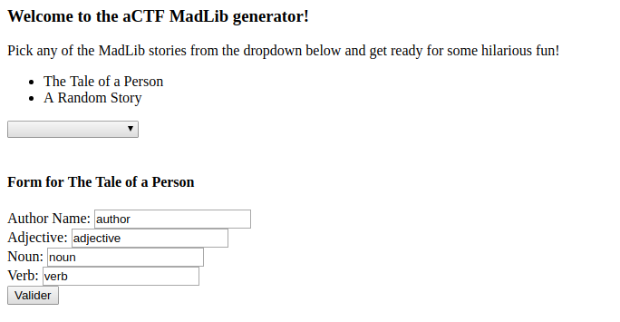
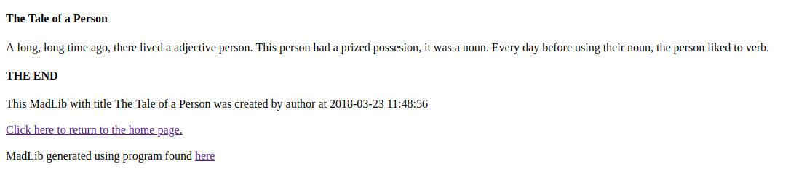
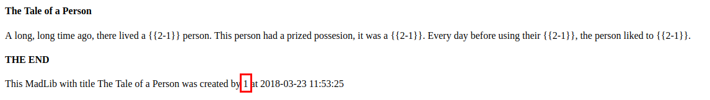
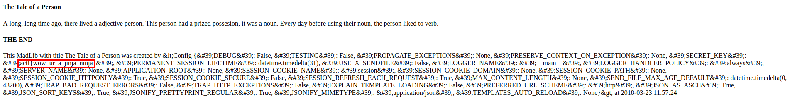

# Angstrom - CTF writeup - MADLIBS - 120 pts

- On se retrouve avec une page web dans laquelle on peut saisir des données en fonction d'un template.


- On complète les données et on obtient nos données formatées dans un template.


- Le code source de l'application est mis à disposition : [app.py](src/app.py)
  - On voit évidement ce qui nous interresse :
```python
app.secret_key = open("flag.txt").read()
```

- On cherche du coté de template injection en envoyant du `{{2-1}}` dans chaque champs disponible. On obtient alors une interprétation dans le champ author :


- Il s'agit donc de template injection le problème est la limitation du nombre de charactères :
```python
authorName = inpValues.pop(0)[:12]
```

- Si l'on exclus les `{{}}` il ne nous reste que 8 chars pour effectuer notre injection.
- Au final après quelques recherches sur l'injection de template on tombe sur cette source : https://nvisium.com/resources/blog/2016/03/09/exploring-ssti-in-flask-jinja2.html

- On passe donc `{{config}}` en valeur d'auteur et on obtient :


- flag : `actf{wow_ur_a_jinja_ninja}`

By team Beers4Flags

```
 ________
|        |
|  #BFF  |
|________|
   _.._,_|,_
  (      |   )
   ]~,"-.-~~[
 .=] Beers ([
 | ])  4   ([
 '=]) Flags [
   |:: '    |
    ~~----~~
```
