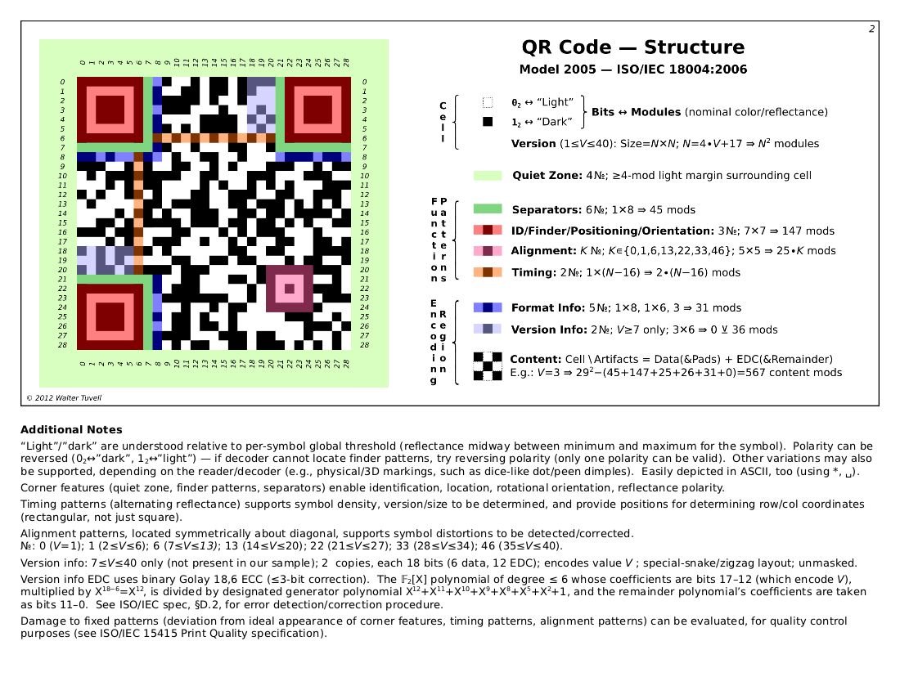

# matrix (misc · 85 pt)

I like to approach problems with a fresh perspective and try to visualize the problem at hand. matrix.txt

```
0x00000000
0xff71fefe
0x83480082
0xbb4140ba
0xbb6848ba
0xbb4a80ba
0x83213082
0xff5556fe
0xff5556fe
0x00582e00
0x576fb9be
0x707ef09e
0xe74b41d6
0xa82c0f16
0x27a15690
0x8c643628
0xbfcbf976
0x4cd959aa
0x2f43d73a
0x5462300a
0x57290106
0xb02ace5a
0xef53f7fc
0xef53f7fc
0x00402e36
0xff01b6a8
0x83657e3a
0xbb3b27fa
0xbb5eaeac
0xbb1017a0
0x8362672c
0xff02a650
0x00000000
```

MATRIX seems to be a reference to the matrix code (datamatrix) using in QRCODE.

I've juste starting by a conversion of each lines in binary :

```
0
11111111011100011111111011111110
10000011010010000000000010000010
10111011010000010100000010111010
10111011011010000100100010111010
10111011010010101000000010111010
10000011001000010011000010000010
11111111010101010101011011111110
11111111010101010101011011111110
10110000010111000000000
1010111011011111011100110111110
1110000011111101111000010011110
11100111010010110100000111010110
10101000001011000000111100010110
100111101000010101011010010000
10001100011001000011011000101000
10111111110010111111100101110110
1001100110110010101100110101010
101111010000111101011100111010
1010100011000100011000000001010
1010111001010010000000100000110
10110000001010101100111001011010
11101111010100111111011111111100
11101111010100111111011111111100
10000000010111000110110
11111111000000011011011010101000
10000011011001010111111000111010
10111011001110110010011111111010
10111011010111101010111010101100
10111011000100000001011110100000
10000011011000100110011100101100
11111111000000101010011001010000
0
```


with a text editor I have replaced 1 with "pixels" and 0 with "spaces"

in ordier to see if it looks like a QRCODE.  


I try to test it on : https://zxing.org/w/decode, but failed :/

When we look a the QRCODE structure 



To be valid, QRCODE must respect somes specifics rules. (wifth, 3 zones with 3 pixel border, etc ..)

i've also note that there is some duplicates lines: 
```
(0xbb6848ba - 0xbb4a80ba)  
(0xef53f7fc - 0xef53f7fc)
```
and column too.

I've remove all duplicate line and colonne and I have added some '0' in front of hexa value to have a QRCODE 29 pixels / 29 pixels
et j'ai rajouté des 0 devant les valeur hexa ne faisant pas 33 caracteres


and seems to  respect QRCODE rules. Let's check it on : https://zxing.org/w/decode

```
Raw text	

IceCTF{1F_y0U_l0oK_c1Os3lY_EV3rY7h1N9_i5_1s_4nD_0s}

Raw bytes	

43 34 96 36 54 35 44 67   b3 14 65 f7 93 05 55 f6
c3 06 f4 b5 f6 33 14 f7   33 36 c5 95 f4 55 63 37
25 93 76 83 14 e3 95 f6   93 55 f3 17 35 f3 46 e4
45 f3 07 37 d0 ec 11 

Barcode format	QR_CODE
Parsed Result Type	TEXT
Parsed Result	

IceCTF{1F_y0U_l0oK_c1Os3lY_EV3rY7h1N9_i5_1s_4nD_0s}
```

eilco
